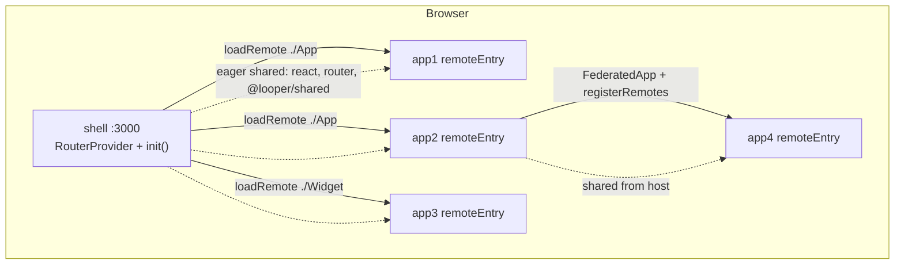

# Looper

A **Module Federation 2.0** monorepo that demonstrates a production-minded **shell host** plus **Rspack** remotes, integrated with **React 19**, **React Router 7**, and a shared `@looper/shared` library. The shell owns the browser URL, menu-driven remotes, nested embeds, widget slots, chunk splitting, and a single MF runtime on the host.

Use this repo as a reference for:

- Host + remote MF 2.0 with `@module-federation/enhanced` and Rspack
- React Router data APIs (`createBrowserRouter`, splat routes, `patchRoutes`, F5-safe deep links)
- Chunk and runtime optimization (`import: false`, `externalRuntime`, named vendor splits)
- Nested routing inside remotes and **embed remotes** mounted inside another remote

---

## Table of contents

1. [Quick start](#quick-start)
2. [Architecture](#architecture)
3. [React Router + Module Federation 2.0](#react-router--module-federation-20)
4. [Routing: splat, nested remotes, embeds](#routing-splat-nested-remotes-embeds)
5. [F5 and deep links](#f5-and-deep-links)
6. [Chunk optimization](#chunk-optimization)
7. [Runtime optimization](#runtime-optimization)
8. [Shared libraries and context](#shared-libraries-and-context)
9. [Menu config, widgets, and scaffolds](#menu-config-widgets-and-scaffolds)
10. [CSS Modules across host and remotes](#css-modules-across-host-and-remotes)
11. [Scripts and ports](#scripts-and-ports)
12. [Testing](#testing)
13. [Further reading](#further-reading)

---

## Start a new project

```bash
npx create-looper-app@latest
```

→ **[INSTALL.md](INSTALL.md)**

## Quick start (reference demo)

```bash
npm install

# Development: shared lib + remotes + shell (shell starts after a short delay)
npm run dev

# Or free ports first, then dev
npm run dev:fresh

# Production build + static serve on fixed ports
npm run prod
# equivalent: npm run services:stop && npm run build && npm run start
```

| Service | Port | Role |
|---------|------|------|
| **shell** (host) | 3000 | SPA, router, eager shared, MF `init()` |
| **app1** | 3002 | Menu remote — Dashboard |
| **app2** | 3003 | Menu remote — Settings (+ embeds app4) |
| **app3** | 3004 | Menu remote + home **widget** expose |
| **app4** | 3005 | **Embed-only** remote (no shell menu route) |

Open [http://localhost:3000](http://localhost:3000). Example URLs:

- `/app1`, `/app1/analytics`
- `/app2/settings`, `/app2/app4`, `/app2/app4/components` (nested embed + F5)
- `/` — home with app3 widget slot

---

## Architecture



| Package | Purpose |
|---------|---------|
| `packages/shell` | Host: HTML, router, sidebar, `mock-menu.json`, MF runtime `init()` |
| `packages/app1`–`app3` | Menu remotes (`exposes: ./App`, optional `./Widget`) |
| `packages/app4` | Embed remote (mounted only inside app2) |
| `packages/shared` | Types, React context (theme, auth, counter), routing helpers, `FederatedApp` |
| `rspack.shared.mjs` | Shared SWC/CSS/MF/splitChunks presets for all Rspack configs |

**Design principle:** the shell is the only app users navigate with the address bar. Remotes export React components; they do not own top-level `BrowserRouter` instances. React, React DOM, React Router, and `@looper/shared` are **singletons provided by the host** so context and hooks work across bundle boundaries.

---

## React Router + Module Federation 2.0

### Two layers of routing

| Layer | Owner | Responsibility |
|-------|--------|----------------|
| **Host** | `packages/shell` | URL → menu app via splat routes (`/app1/*`, `/app2/*`), login, home, 404 |
| **Remote** | Each `packages/appX` | Internal `<Routes>` under the splat remainder (e.g. `analytics`, `settings`) |

The host builds menu routes from `mock-menu.json` and mounts each app with `RemotePage`, which:

1. Calls `loadRemote(\`${remoteName}/${modulePath}\`)` from `@module-federation/enhanced/runtime`
2. Suspends with React 19 `use()` until the expose resolves
3. Wraps the default export in `RemoteSplatProvider` so remotes know the splat tail on cold load / F5

```31:58:packages/shell/src/router.tsx
export const shellRouter = createBrowserRouter(
  [
    {
      path: '/',
      id: 'shell',
      loader: shellConfigLoader,
      element: <ShellGate />,
      hydrateFallbackElement: <ShellLoadingFallback />,
      children: [
        {
          id: 'shell-layout',
          element: <ShellRoot />,
          children: [
            { index: true, element: <HomePage /> },
            { path: 'login', element: <LoginPage /> },
            ...initialMenuRoutes,
          ],
        },
      ],
    },
  ],
  {
    async patchRoutesOnNavigation({ patch }) {
      const config = await loadShellRuntime();
      patchShellMenuRoutes(config, patch);
    },
  },
);
```

### Bootstrap sequence

1. **`bootstrap.tsx`** — `RouterProvider` with providers from `@looper/shared`
2. **`shellConfigLoader`** — `loadShellRuntime()`: fetch menu → `init({ remotes, shared })` once → patch routes
3. **`RemotePage`** — lazy load expose when the matched splat route renders

Menu remotes are registered in `initMfRemotes()` from deduplicated `entry` URLs in the menu config. Embed remotes (app4) are registered at runtime by the parent via `FederatedMount` / `registerRemotes`, not from `mock-menu.json`.

### MF 2.0 stack

- Plugin: `@module-federation/enhanced/rspack` (`ModuleFederationPlugin`)
- Runtime: `@module-federation/enhanced/runtime` (`init`, `loadRemote`, `registerRemotes`)
- Host experiments: `provideExternalRuntime: true`
- Remote experiments: `externalRuntime: true`, `disableSnapshot: true`
- Remote `shareStrategy`: **`loaded-first`** (prefer already-loaded host shared; remotes on demand)

See [docs/module-federation-2-notes.md](docs/module-federation-2-notes.md) for manifest expectations and troubleshooting (RUNTIME-012, duplicate runtime, etc.).

---

## Routing: splat, nested remotes, embeds

### Host splat routes

Each menu app uses a **splat** path in `mock-menu.json`, e.g. `"route": "/app2/*"`. That becomes a child route under the shell layout so any depth under `/app2/...` is handled by one `RemotePage` + one remote root component.

### Remote sub-navigation (do not use relative `NavLink` paths)

Inside a splat boundary, `NavLink to="settings"` resolves relative to the splat and can **stack** segments (`/app2/settings/settings`). Remotes must use:

- `useLeafPathnameBase()` — mount prefix for the current splat (default: **innermost**)
- `joinRemotePath(base, 'segment')` — safe absolute paths under the host URL

```15:32:packages/app1/src/App.tsx
export default function App1App() {
  const base = useLeafPathnameBase();

  return (
    <div className={`app1-root ${styles.chrome}`} data-testid="app1-remote-shell">
      <nav className="remote-subnav" aria-label="App 1 sections">
        <NavLink to={base} end className={subNavLinkClass}>
          Dashboard
        </NavLink>
        <NavLink to={joinRemotePath(base, 'analytics')} className={subNavLinkClass}>
          Analytics
        </NavLink>
      </nav>
      <Routes>
        <Route index element={<DashboardPage />} />
        <Route path="analytics" element={<AnalyticsPage />} />
      </Routes>
    </div>
  );
}
```

### Nested embed remote (app2 → app4)

**app4** has no shell menu entry. **app2** mounts it with:

- `<Route path="app4/*" element={<FederatedApp config={APP4_REMOTE} />} />`
- Parent subnav: `useLeafPathnameBase({ scope: 'outermost' })` + `useEmbedRelativeLocation({ scope: 'outermost' })` on `<Routes location={...} />`
- Child (app4): `useEmbedRelativeLocation()` so nested routes match the URL on first paint and after reload

`FederatedApp` sets `RemoteMountBaseProvider` so `useLeafPathnameBase()` works inside the embed without relying on `useParams` in the remote bundle.

| `scope` | Use when |
|---------|----------|
| `innermost` (default) | Inside the embed remote’s own subnav |
| `outermost` | Parent menu remote linking into an embed section |

Details: [docs/mf-embed-remote-app.md](docs/mf-embed-remote-app.md), [packages/app4/EMBED.md](packages/app4/EMBED.md).

---

## F5 and deep links

Hard requirements for this repo:

- Cold open and **browser refresh (F5)** on URLs like `/app2/app4/components` must match the same UI as client-side navigation
- No infinite loading shell on child navigations or F5

### How it works

1. **Eager menu routes** — `router.tsx` imports `mock-menu.json` at build time and spreads `buildMenuPageRoutes(menuFallback)` into the initial route tree **before** any async loader runs. That way the data router can match deep splat paths on first paint.

2. **`patchRoutesOnNavigation`** — When menu config is fetched, routes can be patched again if the live config differs from the fallback JSON.

3. **`ShellGate` does not block on `navigation.state === 'loading'`** — Revalidation on F5 would otherwise show the shell fallback forever while a deep child route is active.

4. **`RemoteSplatProvider` + `useEmbedRelativeLocation`** — On F5, splat remainders are passed into remotes so `<Routes location={...} />` aligns with the full URL even when match metadata is still settling.

5. **Dev `publicPath: '/'` on shell** — Deep splat URLs load JS chunks from the origin root (not a broken relative path). Production uses `publicPath: 'auto'`.

Verify manually:

```text
http://localhost:3000/app2/app4/components   # open, then F5
```

E2E: `e2e/embed-remote-mount.spec.ts` (reload on deep embed), `e2e/shell-remote-subnav.spec.ts` (subnav without path stacking).

---

## Chunk optimization

Configuration lives in [`rspack.shared.mjs`](rspack.shared.mjs) via `baseOptimization({ shell | remote })`.

### Host (`shell: true`) — `shellSplitChunks`

Named cache groups for long-lived vendor code:

| Chunk | Contents |
|-------|----------|
| `react.js` | react, scheduler, jsx runtimes |
| `react-dom.js` | react-dom |
| `react-router.js` | react-router (+ cookie helpers) |
| `mf-runtime.js` | `@module-federation/*` |
| `vendor.js` | other `node_modules` |
| `main.js` | app bootstrap |

MF **shared** dependencies are still marked **`eager: true`** on the host, so they ship in entry-related chunks by design; splitting isolates cache keys and makes size visible.

### Remotes (`remote: true`)

- **`sharedFromHost`** with **`import: false`** — React, React DOM, jsx runtimes, react-router, and `@looper/shared` are **not** bundled into remote artifacts. `mf-manifest.json` should show **empty** `shared.assets.js.sync/async`.
- **`remoteSplitChunks`** — A `vendor` group that **excludes** React/router/jsx packages so a stray `vendor.js` never duplicates host singletons.
- **`entry: {}`** in production — No standalone `main.js` on remotes; only `remoteEntry.js` + `__federation_expose_*.js` (+ CSS).
- **`concatenateModules: false`** on remotes — Safer MF expose boundaries in production.

After `npm run build`, inspect `packages/app1/dist/mf-manifest.json` and `e2e/mf-remote-chunks.spec.ts` (shared must not list JS assets; `remoteEntry` size cap).

### General optimizations

`usedExports`, `innerGraph`, `mangleExports`, `removeEmptyChunks`, `mergeDuplicateChunks` are enabled from `baseOptimization`. Production uses `devtool: false` on shell and remotes.

---

## Runtime optimization

### Shared modules: host provides, remotes consume

| Setting | Host (`sharedEagerHost`) | Remote (`sharedFromHost`) |
|---------|--------------------------|---------------------------|
| `singleton` | `true` | `true` |
| `eager` | `true` | — |
| `import` | bundled | **`false`** (no fallback copy) |

Remotes must not ship a second React or Router; the host must initialize shared scope before `loadRemote`.

### Thin `remoteEntry.js` — external runtime

| | Without `externalRuntime` | With experiments (this repo) |
|--|---------------------------|------------------------------|
| `remoteEntry.js` | ~100 KB raw | ~43 KB raw (~14 KB gzip) |
| Runtime core | In each remote entry | Once on shell (`provideExternalRuntime`) |

Shell calls `init()` in `loadShellRuntime()` **before** the first `loadRemote`. Embed parents rely on the same global `_FEDERATION_RUNTIME_CORE` after shell bootstrap.

Build-time host shared is mirrored at runtime in [`packages/shell/src/loaders/mfRuntimeShared.ts`](packages/shell/src/loaders/mfRuntimeShared.ts) for `init({ shared: shellRuntimeShared })`.

### `shareStrategy: 'loaded-first'`

Prefer shared modules already loaded on the host; defer pulling remote entries until needed. Improves startup when a remote origin is temporarily offline and pairs well with `import: false`.

### JSX

All packages use **automatic** JSX (`swcTsxHost`). Remotes share `react/jsx-runtime` and `react/jsx-dev-runtime` from the host — required for React 19 remotes in dev (avoids `dispatcher.getOwner is not a function`).

### What we intentionally avoid

- No `runtimeChunk` in Rspack config (reduces class of remote-entry load issues)
- Opening a remote origin alone (e.g. `:3002` without shell) is unsupported by design — **shell-first**

---

## Shared libraries and context

`@looper/shared` holds:

- **Providers:** `ThemeProvider`, `AuthProvider`, `CounterProvider` — demonstrate cross-remote React context when everything uses host singletons
- **Menu types:** `AppConfig`, `AppMenuItem`, `appMfContainerName()`, `isAppPage()`
- **Federation helpers:** `FederatedApp`, `FederatedMount`, `RemoteSplatProvider`, `useLeafPathnameBase`, `useEmbedRelativeLocation`, `joinRemotePath`
- **Debug hooks:** `looperDebug`, `looperDebugShellReady`, `looperDebugRemoteLoaded`, etc. (used by Playwright)

Build shared first in CI/typecheck: `npm run build -w packages/shared`.

---

## Menu config, widgets, and scaffolds

Menu source: [`packages/shell/public/mock-menu.json`](packages/shell/public/mock-menu.json).

| Field | Meaning |
|-------|---------|
| `route` | Host splat path, e.g. `/app1/*` |
| `entry` | `remoteEntry.js` URL |
| `module` | Expose path, default `./App` |
| `displayMode: "widget"` | No sidebar route; rendered in a `WidgetSlot` |
| `widgetSlot` | e.g. `home` on `HomePage` |
| `remoteName` | MF container name when different from `id` |

### New menu remote (sidebar + `/appX/*`)

```bash
npm run scaffold:remote -- <name> <port> ["Display name"]
npm install
npm run dev
```

Updates package, `mock-menu.json`, Playwright ports, and `looper-services.sh`. Guide: [docs/mf-remote-new-app.md](docs/mf-remote-new-app.md).

### New embed remote (no shell menu)

```bash
npm run scaffold:embed -- <name> <port> ["Display name"]
```

Parent mounts with `FederatedApp`. Guide: [docs/mf-embed-remote-app.md](docs/mf-embed-remote-app.md).

---

## CSS Modules across host and remotes

From `rspack.shared.mjs`:

- `*.module.css` → CSS Modules with scoped names `[uniqueName]-[name]__[local]` (per MF `output.uniqueName`)
- Other `*.css` → global CSS
- Default import style: `import styles from './X.module.css'`

Production emits CSS next to expose chunks (e.g. `__federation_expose_App.css`).

---

## Scripts and ports

| Script | Description |
|--------|-------------|
| `npm run dev` | Concurrent dev servers (shared, app1–4, shell) |
| `npm run dev:fresh` | `scripts/looper-services.sh dev` — kill ports 3000, 3002–3005, then dev |
| `npm run build` | Production build: shared → apps → shell |
| `npm run start` | Assert ports free, serve all `dist/` folders |
| `npm run prod` | stop → build → start |
| `npm run services:stop` / `status` | Port cleanup / inspection |
| `npx playwright test` | E2E (dev webServers in `playwright.config.ts`) |
| `npm run test:e2e:prod` | E2E against production build |
| `npm run typecheck` | Typecheck all workspaces (builds shared first) |
| `npm run lint` | ESLint |
| `npm run build:csp` | Generate `docker/csp-policy.txt` from mock-menu |
| `npm run docker:up` | Production stack via Docker Compose |

### Docker

```bash
npm run docker:build
npm run docker:up
# shell http://localhost:3000 — remotes on 3002–3005

# With local ui-looper:
npm run docker:up:ui
```

Optional UI kit: run [ui-looper](../ui-looper) on `:3030` or set CDN URL in `mock-menu.json` `system` entry.

Reserved ports: **3000** shell, **3002** app1, **3003** app2, **3004** app3, **3005** app4.

---

## Testing

Playwright config: [`playwright.config.ts`](playwright.config.ts) (`baseURL` http://localhost:3000, starts all dev servers).

Representative suites:

| Spec | Covers |
|------|--------|
| `e2e/mf-remote-chunks.spec.ts` | Manifest: no shared JS on remotes; expose chunk shape; `remoteEntry` size |
| `e2e/shell-remote-subnav.spec.ts` | app1/app2 subnav URLs (no segment stacking) |
| `e2e/embed-remote-mount.spec.ts` | app2→app4 embed, deep URL, F5, home widget |
| `e2e/context-sharing.spec.ts` | Shared React context across remotes |
| `e2e/shell-config-loading.spec.ts` | Menu loader / shell ready markers |

Debug markers: `e2e/helpers/looper-debug.ts` (`[looper] shell:ready`, `remote:app2:loaded`, `embed:app4:loaded`, …).

```bash
npx playwright test
npx playwright test e2e/embed-remote-mount.spec.ts
```

---

## Further reading

| Document | Topic |
|----------|--------|
| [docs/module-federation-2-notes.md](docs/module-federation-2-notes.md) | MF 2.0 flags, manifest matrix, runtime-core size, risks |
| [docs/mf-remote-new-app.md](docs/mf-remote-new-app.md) | Scaffold menu remote, widgets, CSS |
| [docs/mf-embed-remote-app.md](docs/mf-embed-remote-app.md) | Embed remote, F5, `FederatedApp` |
| [rspack.shared.mjs](rspack.shared.mjs) | Shared presets (copy into new packages) |
| [templates/mf-remote-app/README.md](templates/mf-remote-app/README.md) | Template tokens |
| [templates/mf-embed-remote-app/README.md](templates/mf-embed-remote-app/README.md) | Embed template |

Official MF docs: [module-federation.io](https://module-federation.io) — especially [shared](https://module-federation.io/configure/shared), [experiments](https://module-federation.io/configure/experiments), [shareStrategy](https://module-federation.io/configure/sharestrategy), and [Rspack plugin guide](https://module-federation.io/guide/build-plugins/plugins-rspack).

---

## Repository layout

```text
looper/
├── rspack.shared.mjs          # MF shared, splitChunks, SWC, CSS
├── packages/
│   ├── shell/                 # Host SPA + router
│   ├── shared/                # Cross-cutting library
│   ├── app1/ … app4/         # MF remotes
├── templates/                 # scaffold sources
├── e2e/                       # Playwright
├── docs/                      # Deep-dive notes (EN/RU)
└── scripts/                   # looper-services.sh, scaffolds, port checks
```

**Typical change locations**

| Goal | Where to edit |
|------|----------------|
| New sidebar app | `scaffold:remote`, `mock-menu.json`, remote `src/App.tsx` |
| Embed inside a remote | `scaffold:embed`, parent `embedded/*.ts`, `FederatedApp` route |
| Host route / F5 behavior | `packages/shell/src/router.tsx`, `loaders/shellRuntime.ts` |
| MF / chunk policy | `rspack.shared.mjs`, per-package `rspack.config.ts` |
| Cross-remote utilities | `packages/shared/src/` |

---

## License

Private monorepo (`"private": true` in root `package.json`). Adjust license section if you open-source the project.
